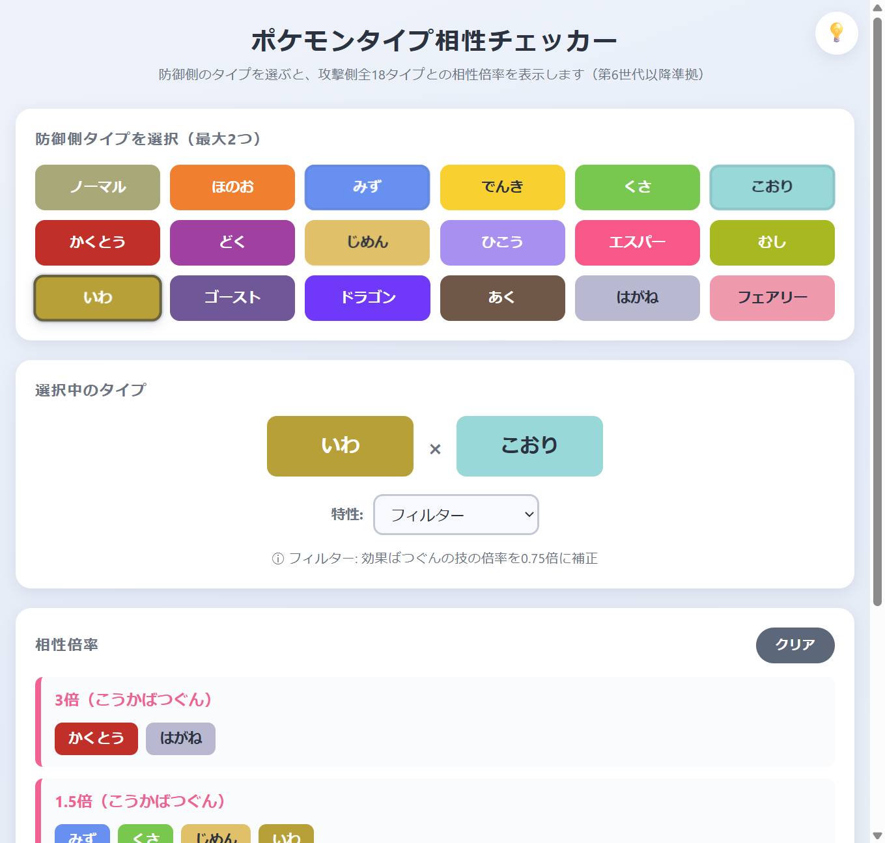
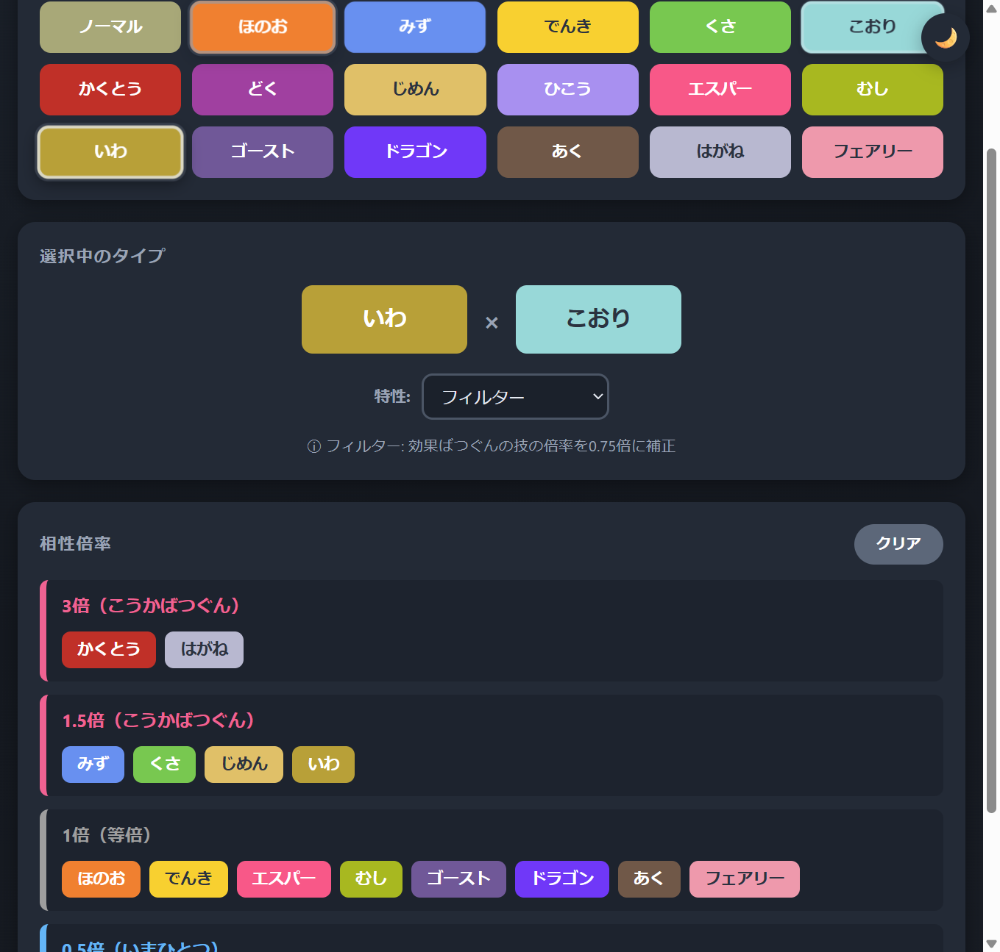
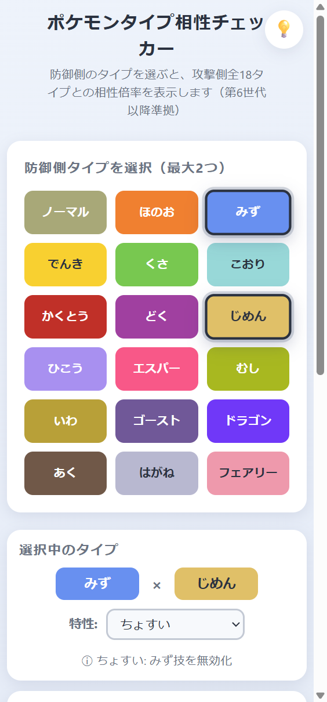

<!--
作成日: 2026-07-04
処理名称: プロジェクトREADME
処理概要: ポケモンタイプ相性チェッカー（ver2 / Electron版）の概要・使い方・構成・開発情報をまとめたドキュメント
ファイル名: README.md
-->

# ポケモンタイプ相性チェッカー

防御側ポケモンのタイプ（最大2つ）と特性を選ぶと、攻撃側全18タイプとの相性倍率を一目で確認できるアプリです。ver2から**Electron製デスクトップアプリ**になり、同じ画面がブラウザ（GitHub Pages）でもそのまま動作します。

**▶ ブラウザで今すぐ使う: https://sgkz0920.github.io/pokemon-type-chart/**

| PC（ライト） | PC（ダーク） | スマホ幅 |
|:---:|:---:|:---:|
|  |  |  |

## 主な機能

- **タイプ選択**: 18タイプから最大2つ選択（複合タイプ対応）。3つ目を選ぶと古い方が自動で外れます
- **相性計算**: 第6世代以降のタイプ相性表に準拠（はがねに対するあく・ゴースト等倍など）
- **特性補正**: 「ふゆう」「あついしぼう」「フィルター」「ふしぎなまもり」など、技のタイプに作用する防御側特性16種に対応
- **倍率別表示**: 計算結果を倍率ごとにグルーピングし、タイプごとのイメージカラーで表示。特性補正で生じる3倍・1.5倍・0.625倍などの中間倍率にも対応
- **ダークモード**: 画面右上の電球ボタンでライト／ダークを切り替え。設定は保存され、初回はOS設定に従います
- **スマホ最適化**: タイプ選択の確定（2つ選択、または同一タイプの2度タップ）で「選択中のタイプ」へ、クリアで「防御側タイプ選択」へ自動スクロール。選択中エリアはコンパクト表示で相性倍率が見やすいレイアウト

## 使い方

### デスクトップアプリとして使う（Electron）

```bash
git clone https://github.com/sgkz0920/pokemon-type-chart.git
cd pokemon-type-chart
npm install
npm start
```

### ブラウザで使う

上記URLを開き、防御側のタイプ（と必要なら特性）をタップするだけです。

### iPhoneでアプリのように使う

1. Safariで https://sgkz0920.github.io/pokemon-type-chart/ を開く
2. 共有ボタン（□↑）→「**ホーム画面に追加**」
3. ホーム画面のアイコンからワンタップで起動できます

## プロジェクト構成

```
pokemon/
├── package.json                 # npm定義（start / test / test:e2e）
├── index.html                   # ルートURL用リダイレクトページ（GitHub Pages）
├── data/
│   ├── types.json               # タイプ定義＋18×18タイプ相性表
│   └── abilities.json           # 特性定義（宣言的ルール）
├── src/
│   ├── main/
│   │   ├── main.js              # Electronメインプロセス（ウィンドウ生成・データ提供IPC）
│   │   └── preload.cjs          # contextBridgeによる安全なAPI公開
│   └── renderer/
│       ├── index.html           # 画面構造
│       ├── style.css            # スタイル（ライト／ダークテーマ変数）
│       ├── app.js               # 表示層・状態管理・イベント処理
│       └── logic.js             # ロジック層（純粋関数のみ）
├── test/
│   └── logic.test.mjs           # 単体テスト（node --test）
├── scripts/
│   └── e2e.mjs                  # E2E検証（Playwright + Electron実起動）
└── doc/                         # 要求仕様書・設計書一式
```

## 技術構成

- **Electron + HTML / CSS / JavaScript（Vanilla、ESモジュール）** — UIフレームワーク・ビルド工程なし
- **セキュリティ**: `contextIsolation` / `sandbox` 有効、`nodeIntegration` 無効。データはpreloadの `contextBridge` 経由でIPC受け渡し
- **データ分離**: タイプ相性（[data/types.json](data/types.json)）と特性（[data/abilities.json](data/abilities.json)）を別JSONで管理。特性の追加はJSONへの1エントリ追加で完結
- **アーキテクチャ**: データ層（JSON）／ロジック層（純粋関数 [logic.js](src/renderer/logic.js)）／表示層（[app.js](src/renderer/app.js)）の3層構成。状態変更のたびに全再描画する単方向データフロー
- **ブラウザ互換**: レンダラーはElectron APIに直接依存せず、`window.pokeApi`（Electron）がなければ `fetch`（ブラウザ）でJSONを読む2段構え。GitHub Pagesでも同一コードが動作
- **テーマ**: 全配色をCSSカスタムプロパティ化し、`data-theme` 属性で切り替え。`localStorage` に永続化

設計の詳細は [doc/](doc/) 配下の各設計書（Electron移行は [pokemon_type_chart_electron_design.md](doc/pokemon_type_chart_electron_design.md)）を参照してください。

## 開発

- 機能追加は設計書の作成・更新 → ブランチ上で実装 → 検証 → `main` へマージ、の流れで進めています
- **単体テスト**: `npm test` — データ整合性と倍率計算・特性補正・グルーピングを検証（Node.js標準テストランナー）
- **E2E検証**: `npm run test:e2e` — PlaywrightでElectronを実起動し、表示・特性補正・ダークモード永続化・クリア動作を検証
- `main` へのpushでブラウザ版（GitHub Pages）に自動反映されます（反映まで1〜2分）

## バージョン履歴

| バージョン | 内容 | 参照 |
|---|---|---|
| ver2（現行） | Electron化、データのJSON分離、ダークモード、スマホ操作性改善 | `main` |
| ver1 | 単一HTMLファイル版（サーバ・外部ライブラリ不使用） | タグ [`v1.0`](../../tree/v1.0) / ブランチ [`ver1`](../../tree/ver1) |

## 将来の拡張候補

- **逆引き機能**: 攻撃側のタイプを選択し、どのタイプに有利・不利かを表示するモード（要求仕様書 4章）
- **配布パッケージ化**: electron-builder等によるインストーラ作成
